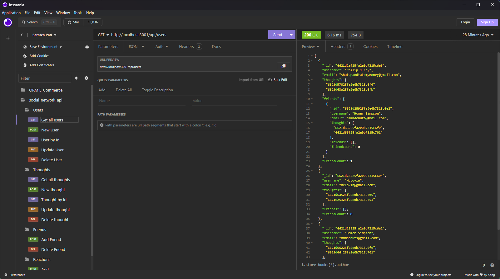

# Social Network API

## Description

This project was made to demonstrate the use of MongoDB by creating a social network API. With this API you are able to create users, users can then share their thoughts, add one another as friends, and add comments on their friends posts

## Table of Contents

- [Installation](#installation)
- [Usage](#usage)
- [Credits](#credits)
- [License](#license)

## Installation

You will need to have MongoDB and Insomnia, and understand how to use them to run this application in it's current state. After cloning the repository, navigate to the repository in your console, open the terminal, type "npm i", then "npm start". From there you will need to make your GET, PUT, POST, and DEL requests through Insomnia

## Usage

Watch the Demo video to see the applications usage

- [Walkthrough video of application in action](https://drive.google.com/file/d/1i1WzS6BLqVMbIERTmrmK4A26c6PLCiJ3/view?usp=sharing)
- Note: you may have to change quality to higher setting for better viewing experience

## Credits 

N/A

## License

Unlicense 

Click the badge for further information

## Questions

For any further questions, please contact davesalter1988@gmail.com, and visit https://github.com/DaveSalterM for additional projects
